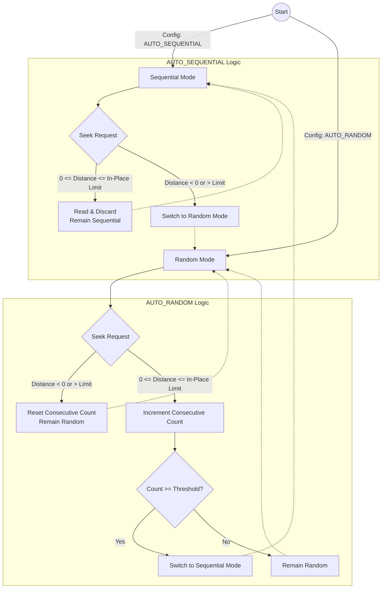

# Adaptive Read Strategy

## Configuration Knobs

*   `analytics-core.read.file-access-pattern`: Can be forced to strictly `RANDOM` or `SEQUENTIAL`, or left on the adaptive defaults `AUTO_SEQUENTIAL` or `AUTO_RANDOM`.
*   `analytics-core.adaptive-read.sequential-read-threshold`: The number of consecutive sequential reads required to switch from random mode back to sequential mode (Default: 3).
*   `analytics-core.read.inplace-seek-limit-bytes`: If a forward seek is smaller than this limit (Default: 128KB), the stream will read and discard the bytes rather than closing and opening a new network connection.

## How it Works
`gcs-analytics-core` implements an adaptive read strategy within [`GoogleCloudStorageInputStream`](../../core/src/main/java/com/google/cloud/gcs/analyticscore/core/GoogleCloudStorageInputStream.java). The stream continuously monitors the application's read patterns and dynamically adjusts its underlying network requests to Google Cloud Storage to balance throughput and network efficiency.

The optimization relies on shifting between two primary modes based on observed behavior:

*   **Sequential Mode (`AUTO_SEQUENTIAL`)**: When the stream detects sequential reads, it proactively fetches larger chunks of data into an internal buffer. This improves throughput for full-table scans by keeping the TCP connection saturated and minimizing the number of individual network GET requests.
*   **Random Mode (`AUTO_RANDOM`)**: If the application performs multiple non-contiguous seeks or skips around the file (typical in columnar point lookups), the stream switches to `RANDOM` mode. In this mode, it fetches only the exact bytes requested by the application. This prevents wasting network bandwidth and memory on data that will never be consumed.

### State Transitions and In-Place Seeks

The stream acts as a state machine. It begins in a configurable default state and transitions based on the distance of `seek()` operations and the number of consecutive sequential reads.

**In-Place Seeks (Read and Discard)**
When the stream is in Sequential Mode and a forward `seek()` occurs, it must decide whether to establish a new network connection for the new offset or keep the existing connection open. Closing and reopening an network connection is relatively expensive.

If the seek distance is small (less than `analytics-core.read.inplace-seek-limit-bytes`), the stream will simply read and discard the intermediate bytes from the existing connection. This is faster than dropping the connection and establishing a new one, thereby maintaining the high throughput of Sequential Mode.

## Internal Implementation Details

The core logic of this feature is decoupled from the stream itself and implemented using the Strategy pattern in the `client` module:

*   **[`ReadStrategy`](../../client/src/main/java/com/google/cloud/gcs/analyticscore/client/ReadStrategy.java)**: The base interface defining operations for reading and seeking data.
*   **[`AdaptiveReadStrategy`](../../client/src/main/java/com/google/cloud/gcs/analyticscore/client/AdaptiveReadStrategy.java)**: A composite strategy that tracks heuristics (like consecutive sequential reads and seek distances) and delegates the actual network I/O to either the sequential or random strategy based on the current state.
*   **[`SequentialReadStrategy`](../../client/src/main/java/com/google/cloud/gcs/analyticscore/client/SequentialReadStrategy.java)**: The implementation for `AUTO_SEQUENTIAL` and `SEQUENTIAL` modes. It actively buffers data ahead of the application's read requests to maximize TCP throughput.
*   **[`RandomReadStrategy`](../../client/src/main/java/com/google/cloud/gcs/analyticscore/client/RandomReadStrategy.java)**: The implementation for `AUTO_RANDOM` and `RANDOM` modes. It issues exact-byte network `GET` requests for the requested bounds.
*   **[`AbstractReadStrategy`](../../client/src/main/java/com/google/cloud/gcs/analyticscore/client/AbstractReadStrategy.java)**: Provides common base functionality for the concrete implementations.
