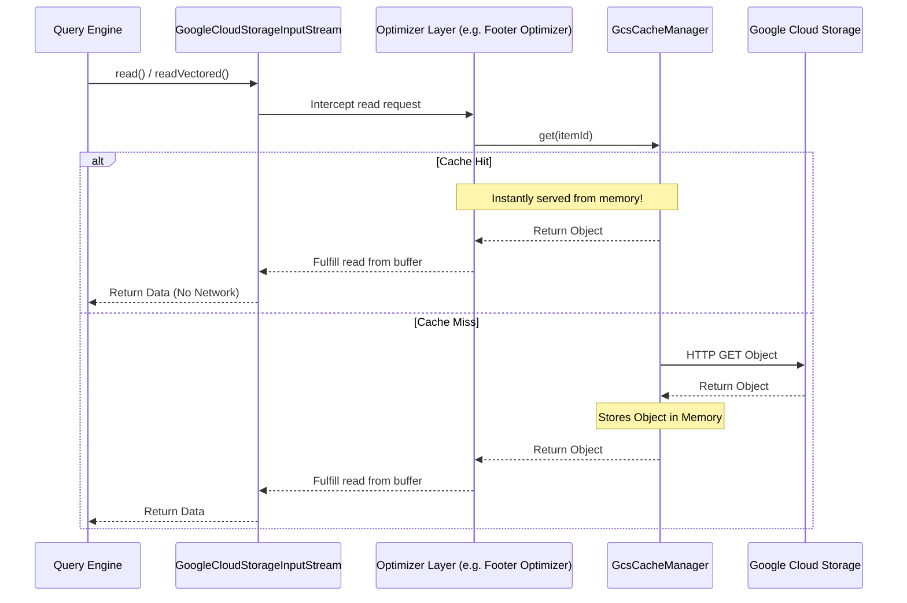

# Caching Layer

## How it Works
To further reduce latency for metadata-heavy operations, `gcs-analytics-core` provides a configurable in-memory caching layer using Caffeine. The cache is bound to the lifecycle of the `GcsFileSystem` instance. When multiple tasks or queries running on the same executor node attempt to access the same metadata objects, the cache ensures that only the first request incurs a network round-trip.

*   **Small Object Cache**: Caches the entirety of very small objects. This is effective for larger datasets with small fact tables or a few hot small files. For example, allocating a 500 MB small object cache on a 30-node cluster yields up to a 5% scan time improvement for the TPCDS 10TB benchmark in Apache Iceberg.
*   **Footer Cache**: Caches the prefetched footers of larger files (like Parquet). If multiple readers need to parse the same file's schema, it can be served instantly from memory. *(Note: Because this cache is bound to the `GcsFileSystem` instance, it provides no additional performance gains over footer prefetching in workloads like Apache Iceberg where the filesystem instance is not globally shared. It is most effective in use cases where a single `FileSystem` instance is initialized and heavily reused.)*

### Cache Flow Diagram

## Internal Implementation Details

The caching layer is implemented using a pluggable, generic cache interface to ensure thread-safety and atomic operations across concurrent reads.

*   **[`AnalyticsCacheManager`](../../client/src/main/java/com/google/cloud/gcs/analyticscore/client/AnalyticsCacheManager.java)**: A thread-safe registry that initializes and holds the specialized caches (footer cache and small object cache). It ensures that concurrent requests for the same object (`GcsItemId`) only trigger a single network load via its atomic `getFooter` and `getSmallObject` methods.
*   **[`AnalyticsCache`](../../common/src/main/java/com/google/cloud/gcs/analyticscore/common/cache/AnalyticsCache.java)**: The base interface defining generic in-memory cache operations.
*   **[`AnalyticsCacheCaffeineImpl`](../../common/src/main/java/com/google/cloud/gcs/analyticscore/common/cache/AnalyticsCacheCaffeineImpl.java)**: The primary implementation backed by a Caffeine `Cache`. It is configured with a maximum byte weight and dynamically evicts older entries.
*   **[`AnalyticsCacheNoOpImpl`](../../common/src/main/java/com/google/cloud/gcs/analyticscore/common/cache/AnalyticsCacheNoOpImpl.java)**: A singleton, no-op implementation used when a specific cache is disabled via configuration, allowing the manager to operate without complex null checks.

## Configuration Knobs

The caching subsystem is configured via [`GcsCacheOptions`](../../client/src/main/java/com/google/cloud/gcs/analyticscore/client/GcsCacheOptions.java):

**Small Object Caching:**
*   `analytics-core.small-file.cache.enabled`: Controls whether small object caching is enabled (Default: `false`).
*   `analytics-core.small-file.cache.max-size-bytes`: The maximum capacity of the small object cache (Default: `209715200` i.e., 200 MB).

**Footer Caching:**
*   `analytics-core.footer.cache.enabled`: Controls whether the Parquet footer cache is enabled (Default: `false`).
*   `analytics-core.footer.cache.max-size-bytes`: The maximum capacity of the footer cache (Default: `104857600` i.e., 100 MB).
