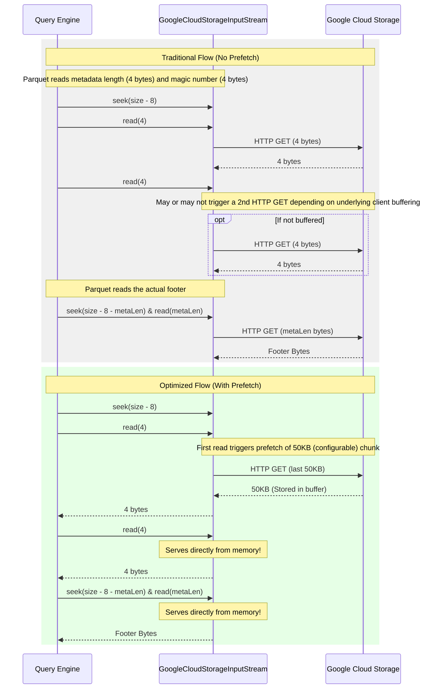

# Footer Prefetching

## How it Works
When query engines (like Spark) process columnar formats like Parquet or ORC, they must first read the file's "footer" to understand the schema and the byte offsets of the data blocks (row groups/stripes). Normally, this requires opening the file (to get its size) and then immediately executing a seek-and-read operation at the very end of the file, incurring additional network latency before any actual data processing can begin.

`gcs-analytics-core` optimizes this by heuristically "prefetching" a chunk of bytes from the end of the file during the initial file open operation. If the query engine then requests the footer, the library can serve it directly from memory, eliminating an entire network round-trip.

### Traditional vs. Prefetched Read Flow

## Trigger Conditions
Footer prefetching is specifically optimized for columnar file formats like Parquet (`.parquet`) and ORC (`.orc`). By default, it is enabled and triggers during the initialization of the [`GoogleCloudStorageInputStream`](../../core/src/main/java/com/google/cloud/gcs/analyticscore/core/GoogleCloudStorageInputStream.java). The amount of data fetched depends on the total size of the file, as smaller files generally have smaller footers.

*   **Small Files (<= 1 GB)**: Fetches a smaller chunk (default 50 KB).
*   **Large Files (> 1 GB)**: Fetches a larger chunk (default 1 MB) to accommodate potentially large schemas and row group indexes.

### Edge Cases and Limitations
To calculate how much data to prefetch from the end of the file, the stream **must know the total file size** at initialization time.
*   If the query engine integrates using APIs that provide `GcsFileInfo` or explicitly pass the file length, the footer is prefetched efficiently.
*   If the file length or item info is **not provided** when opening the stream (e.g., only passing a `GcsItemId`), the optimizer is unable to proactively prefetch the footer alongside the initial stream open request. It will defer size calculation, which may negate the performance benefits by incurring additional network round-trips. Always strive to pass metadata when initializing streams. *(Note: In the future, this limitation will be removed by employing heuristics to intelligently estimate or handle unknown file sizes).*

## Configuration Knobs

The prefetch behavior can be tuned via [`GcsReadOptions`](../../client/src/main/java/com/google/cloud/gcs/analyticscore/client/GcsReadOptions.java):

*   `analytics-core.footer.prefetch.enabled`: Controls whether footer prefetching is enabled (Default: `true`).
*   `analytics-core.small-file.footer.prefetch.size-bytes`: Footer prefetch size for files up to 1 GB (Default: `51200` i.e., 50 KB).
*   `analytics-core.large-file.footer.prefetch.size-bytes`: Footer prefetch size for files larger than 1 GB (Default: `1048576` i.e., 1 MB).

Additionally, prefetched footers can be cached across multiple streams using an in-memory cache bound to the [`GcsFileSystem`](../../client/src/main/java/com/google/cloud/gcs/analyticscore/client/GcsFileSystem.java) instance. This is configured via [`GcsCacheOptions`](../../client/src/main/java/com/google/cloud/gcs/analyticscore/client/GcsCacheOptions.java):
*   `analytics-core.footer.cache.enabled`: Controls whether the Parquet footer cache is enabled (Default: `false`).
*   `analytics-core.footer.cache.max-size-bytes`: The maximum capacity of the footer cache (Default: `104857600` i.e., 100 MB).
