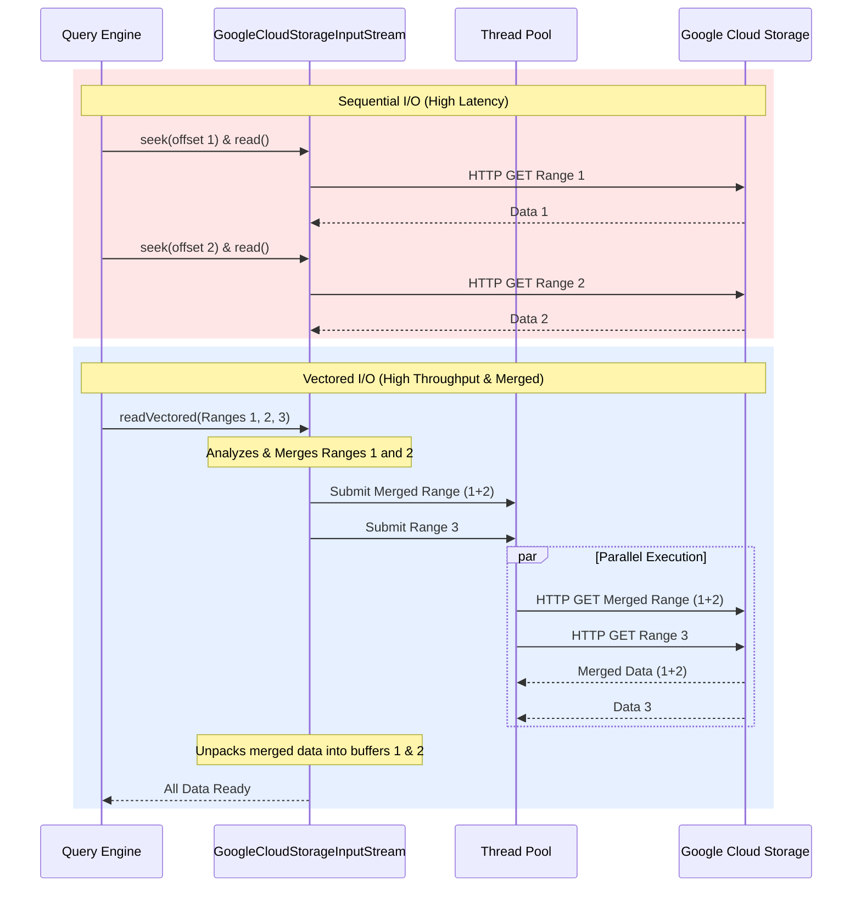

# Vectored I/O

## How it Works
Query engines (like Spark) processing columnar formats (like Parquet or ORC) often need to read multiple, non-contiguous byte ranges from a single file simultaneously (for example, fetching specific columns for a row group). Traditionally, engines would issue individual, sequential `seek()` and `read()` calls for each range, which incurs high latency due to multiple round-trips to GCS.

`gcs-analytics-core` implements **Vectored I/O**, allowing query engines to submit a list of required byte ranges all at once. The library then processes these ranges in parallel using a dedicated thread pool, increasing throughput and reducing query execution time.

### Range Merging Optimization
To further minimize the number of separate HTTP requests made to GCS, the library analyzes the submitted ranges before dispatching them. If multiple requested ranges are physically close to each other or overlapping in the file, it "merges" them into a single, larger HTTP GET request. The larger response is then unpacked into the individual buffers requested by the application.

### Sequential vs. Vectored I/O Flow

## Configuration Knobs

Vectored I/O behavior and its merging heuristics can be tuned via [`GcsVectoredReadOptions`](../../client/src/main/java/com/google/cloud/gcs/analyticscore/client/GcsVectoredReadOptions.java):

*   `analytics-core.read.vectored.range.merge-gap.max-bytes`: The maximum gap between two ranges where they will still be merged (Default: 4KB).
*   `analytics-core.read.vectored.range.merged-size.max-bytes`: The maximum total size a merged request is allowed to grow to (Default: 8MB).

The execution thread pool size is managed via [`GcsFileSystemOptions`](../../client/src/main/java/com/google/cloud/gcs/analyticscore/client/GcsFileSystemOptions.java):
*   `analytics-core.read.thread.count`: Number of threads dedicated to parallel range fetching (Default: `Max(16, 4 * Available Cores)`).
